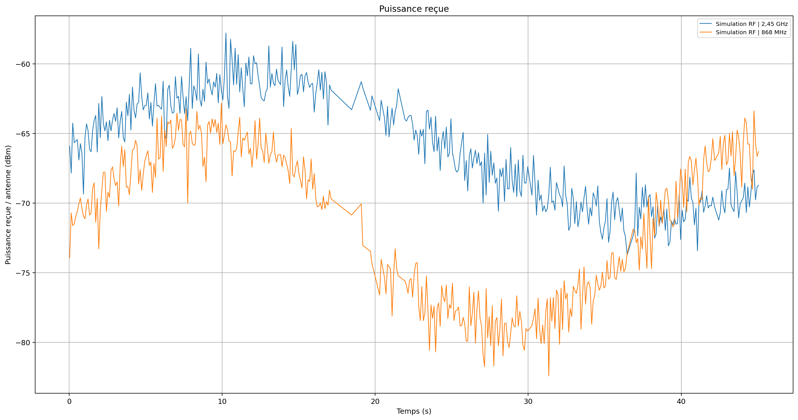

# TEMPO — Observation de l’activité radiofréquence

**Acquérir, visualiser et analyser des signaux RF avec Python et Raspberry Pi.**

TEMPO (*Temps d’Exposition aux ondes électroMagnétiques, Paramètres et Observation*) est un projet de Master 2 EEA réalisé à l’Institut d’Électronique et des Systèmes, Université de Montpellier.

Le dispositif vise l’observation de l’activité RF autour de **868 MHz et 2,45 GHz**, l’estimation de la puissance disponible au connecteur d’antenne et le suivi temporel. Une voie numérique complète cette approche par l’exploitation du RSSI Wi-Fi et de trames BLE.

**Auteur :** Abdoul Kalidou DIALLO · **Encadrement :** Jean Podlecki · **Stage :** avril–août 2026

## Découvrir le projet

- **Sans installation :** [voir une démonstration illustrée](docs/DEMONSTRATION.md#apercu-sans-installation).
- **Sans matériel RF :** [lancer le mode Simulation RF](docs/DEMONSTRATION.md#lancer-la-simulation).
- **Pour approfondir :** [architecture, indicateurs et limites](docs/ARCHITECTURE.md).
- **Pour consulter le code :** [V10 multimode](acquisition_udp/plateforme_tempo_v10_multimode/main.py), point d’entrée retenu pour cette présentation.

## Aperçu : deux bandes RF simulées

*Données de simulation issues d’un export existant du dépôt. Ce graphique illustre le fonctionnement de l’application ; il ne constitue pas une mesure expérimentale.*

## Ce que permet la V10 multimode

| Fonction | Mise en œuvre |
|---|---|
| Découverte sans matériel | Simulation de deux voies RF, explicitement marquée dans les exports |
| Acquisition analogique | Lecture du MCP3208 par SPI et conversion tension–puissance configurable |
| Suivi Wi-Fi | Lecture du RSSI de la liaison active via `iw` |
| Observation BLE | Capture par nRF Sniffer et `tshark` : RSSI, canaux, longueurs et types de PDU selon les champs disponibles |
| Visualisation | Interface Tkinter : tableau de bord, calibration, mesures, graphiques et journal |
| Traçabilité | Exports CSV et PNG, champ `simulated` pour distinguer les sources |
| Analyse temporelle | Horodatage, durée d’acquisition et estimation d’énergie à partir des puissances et durées retenues |

Les variantes LoRa présentes dans le dépôt sont des extensions distinctes. Elles ne font pas partie du parcours de démonstration V10 multimode décrit ici.

## Compétences mobilisées

- **Électronique et instrumentation :** chaîne RF, conversion analogique-numérique, bilan de gain et calibration.
- **Développement Python :** pilotes, acquisition, files d’événements, interface graphique et exports.
- **Communications sans fil :** observation Wi-Fi/BLE et distinction entre puissance RF et informations protocolaires.
- **Analyse de données :** visualisation temporelle, conversions d’unités et explicitation des limites.

## Se repérer dans le dépôt

| Emplacement | Rôle |
|---|---|
| [V10 multimode](acquisition_udp/plateforme_tempo_v10_multimode/) | Application utilisée pour la démonstration |
| [Pilotes](acquisition_udp/plateforme_tempo_v10_multimode/drivers/) | Interfaces MCP3208, Wi-Fi et BLE |
| [Exports](acquisition_udp/plateforme_tempo_v10_multimode/exports/) | Acquisitions et graphiques existants ; vérifier le statut simulé/réel de chaque session |
| [Documentation](docs/DEMONSTRATION.md) | Parcours de découverte et lancement |
| [Versions et expérimentations](acquisition_udp/) | Historique de travail et variantes du projet |

Ce dépôt conserve plusieurs étapes du développement. Le choix de la V10 multimode comme point d’entrée documentaire ne signifie pas qu’elle est la version la plus récente ni qu’elle a fait l’objet d’une validation complète.

## Interprétation des résultats

L’énergie calculée est une **estimation RF**, pas une énergie absorbée par une personne. Le RSSI Wi-Fi décrit la liaison active et ne mesure pas toute l’activité radio ambiante. Les alertes colorées correspondent à des seuils logiciels configurables, pas à une évaluation sanitaire. Les identifications BLE sont indicatives.

Les paramètres de calibration doivent être déterminés pour le matériel utilisé. La démonstration en simulation ne valide ni la précision de la chaîne physique ni sa réponse temporelle.

## Statut

Prototype académique. Cette présentation s’appuie sur le code et les exports présents dans le dépôt. Consulter les [limites et conditions de validation](docs/ARCHITECTURE.md#limites-et-validation) avant de réutiliser les résultats.
