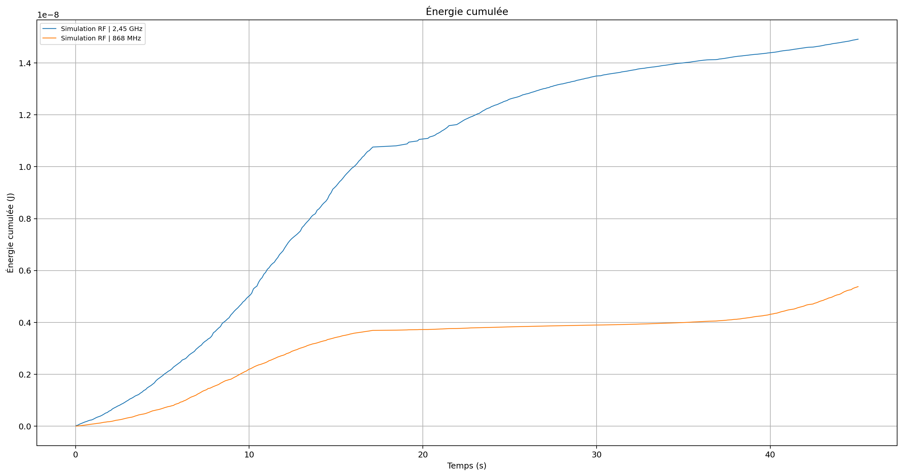

# Démonstration de TEMPO

[Retour à l’accueil](../README.md)

<a id="apercu-sans-installation"></a>
## Aperçu sans installation

Cette session existante permet de découvrir les sorties de l’application directement dans GitHub.

**Provenance :** `acquisition_20260724_154056`, V10 multimode. Le fichier de synthèse indique **826 enregistrements**, simulation activée, MCP3208/BLE/Wi-Fi désactivés. Les 826 lignes du CSV portent `simulated=True`.




- [Consulter la synthèse](../acquisition_udp/plateforme_tempo_v10_multimode/exports/acquisition_20260724_154056/synthese_tempo_v10.csv).
- [Consulter les données sources](../acquisition_udp/plateforme_tempo_v10_multimode/exports/acquisition_20260724_154056/mesures_tempo_v10.csv).

Ces courbes illustrent la chaîne de traitement sur deux bandes simulées. Elles ne démontrent pas la précision de mesure du dispositif physique.

<a id="lancer-la-simulation"></a>
## Lancer la simulation

### Préparer l’environnement

Parcours proposé pour Linux avec une session graphique, Python 3.10 ou supérieur et Tkinter. Aucun Raspberry Pi, ADC ou sniffer n’est nécessaire en mode simulation. Le pilote SPI n’importe `spidev` qu’à l’ouverture de la source physique.

Récupérer uniquement le répertoire de démonstration par un clone partiel :

```bash
git clone --filter=blob:none --sparse https://github.com/Diak23/Detecteur_onde_electromagnetique.git tempo-demo
cd tempo-demo
git sparse-checkout set acquisition_udp/plateforme_tempo_v10_multimode
cd acquisition_udp/plateforme_tempo_v10_multimode
```

Sur Debian/Ubuntu, installer les prérequis système si nécessaire :

```bash
sudo apt install python3-venv python3-tk
```

Créer un environnement isolé et installer la dépendance de visualisation :

```bash
python3 -m venv .venv
source .venv/bin/activate
python -m pip install "matplotlib>=3.7"
python main.py
```

Ces instructions ont été confrontées aux imports et aux pilotes du code. Elles ne constituent pas un compte rendu d’exécution sur tous les systèmes. Le dépôt contient des données historiques volumineuses ; le clone partiel limite le téléchargement aux chemins sélectionnés, qui incluent encore des exports.

### Parcours guidé : une acquisition de 30 secondes

1. Ouvrir l’onglet **Sources / Acquisition**.
2. Cocher uniquement **Simulation RF**.
3. Choisir **Durée limitée**, régler la durée à **30** secondes et garder une période de **100** ms.
4. Cliquer sur **Démarrer**, puis consulter **Tableau de bord TEMPO** et **Mesures**.
5. À l’arrêt automatique, attendre le message confirmant l’export.
6. Consulter **Graphiques**, choisir une grandeur et utiliser le bouton de tracé.
7. Ouvrir le dossier `exports/acquisition_<date>_<heure>/` indiqué dans le journal.

La simulation comporte une composante aléatoire : les courbes diffèrent d’un lancement à l’autre. Pour un nouvel essai indépendant, utiliser **Effacer** après l’arrêt ou relancer l’application ; ne pas supposer que Démarrer efface les mesures précédentes.

### Sorties attendues

| Fichier | Contenu |
|---|---|
| `mesures_tempo_v10.csv` | Enregistrements détaillés, séparateur point-virgule |
| `synthese_tempo_v10.csv` | Sources activées, nombre de mesures, motif d’arrêt et énergie totale calculée |
| `graphes/puissance_recue.png` | Puissance par source |
| `graphes/tension_detecteur.png` | Tension du détecteur, simulée dans ce parcours |
| `graphes/energie_cumulee.png` | Énergie cumulée calculée |
| `graphes/rssi.png` | Pas de données RSSI en simulation RF seule |

**Vérifier `simulated=True` dans chaque ligne de cette démonstration.** Les seuils orange/rouge sont des repères configurables de l’interface.

### Dépannage rapide

| Symptôme | Vérification |
|---|---|
| Erreur liée à Tkinter | Installer le paquet Tkinter adapté à Python |
| Absence d’affichage / erreur DISPLAY | Utiliser une session graphique ; le programme est une application de bureau |
| Erreur SPI ou `spidev` | Désactiver la source MCP3208 pour ce parcours |
| Erreur `iw` ou `tshark` | Désactiver Wi-Fi et BLE pour ce parcours |
| Aucun export | Vérifier que des données ont été acquises, arrêter par le bouton prévu et consulter le journal |

## Passer aux sources physiques

- **MCP3208 :** Raspberry Pi, SPI configuré, dépendance `spidev`, câblage et calibration adaptés à la chaîne RF.
- **Wi-Fi :** Linux, commande `iw`, interface connectée et nom d’interface correct.
- **BLE :** sniffer compatible, `tshark`, extension nRF Sniffer et droits de capture configurés. Renseigner une interface effectivement disponible.
- Désactiver la simulation pour une session exclusivement expérimentale.

Voir [l’architecture et les limites](ARCHITECTURE.md) avant d’interpréter les valeurs.
